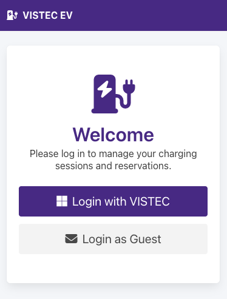
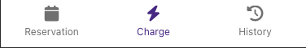
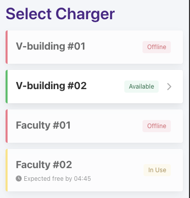
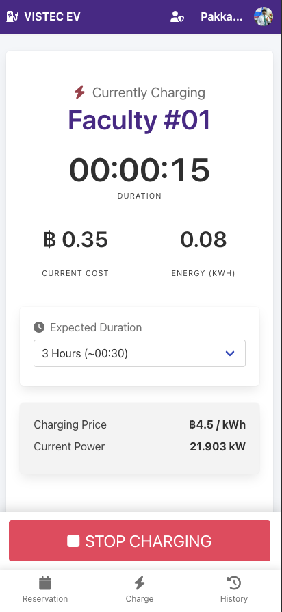
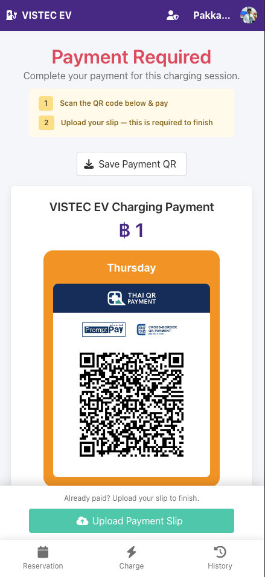
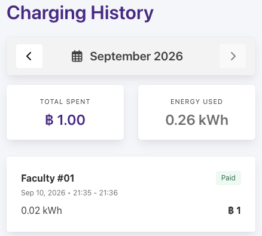
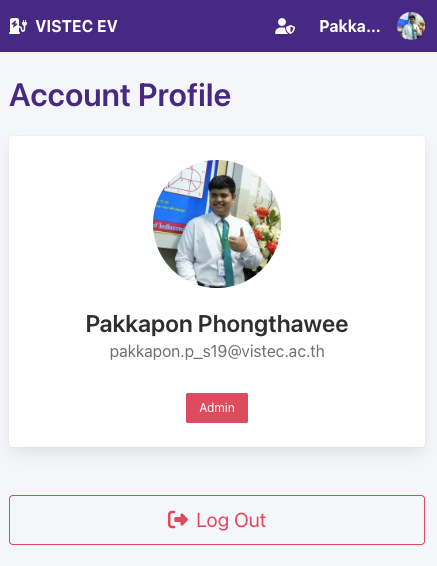

# VISTEC EV — User Guide

A quick guide to logging in, charging your EV, paying your bill, and managing reservations.

## Contents

- [Logging In](#logging-in)
- [Getting Around](#getting-around)
- [Charging Your Car](#charging-your-car)
- [Paying Your Bill](#paying-your-bill)
- [VIP Access (Free Charging)](#vip-access-free-charging)
- [Reservations](#reservations)
- [Charging History](#charging-history)
- [Your Account](#your-account)
- [If Your Account Is Banned](#if-your-account-is-banned)
- [Troubleshooting & Support](#troubleshooting--support)

---

## Logging In

You cannot create your own account from the app — accounts are either:

- **VISTEC login** — tap **Login with VISTEC** and sign in with your VISTEC Microsoft account. Your profile (name, email, photo) is set up automatically the first time you log in.
- **Guest login** — if an administrator has created a guest account for you (with an email and password), tap **Login as Guest**, enter the email and password you were given, and log in.

If you don't have either, contact an administrator — see [Troubleshooting & Support](#troubleshooting--support).

## Getting Around

Once logged in, a bottom navigation bar gives you three tabs:

| Tab | What it's for |
|---|---|
| **Reservation** | View and manage your upcoming charger reservations |
| **Charge** | Pick a charger and start/stop a charging session |
| **History** | See your past charging sessions and monthly totals |

Tap your name/photo in the top-right corner to open **Account** (view your profile, log out). 

## Charging Your Car

1. Open the **Charge** tab. You'll see a list of every charger and connector, each tagged **Available** (green), **In Use** (yellow), or **Offline** (red). 
2. Tap an **Available** charger to open it.
3. You'll see the connector type, maximum power, and the price per kWh. If someone has a reservation coming up on this charger soon, a warning banner tells you when — please finish before then.
4. Plug your car in. Once the charger detects the plug, the **START CHARGING** button becomes active — tap it to begin.
   - If you had a reservation for this exact time slot, starting the session automatically uses it.
   - If someone else's reservation is about to start, the button stays disabled so you don't take their slot.

### While Charging

The screen shows a live-updating duration timer, current cost (฿), and energy used (kWh). If it's your session, you can also set an **Expected Duration** (30 minutes up to 8 hours) — this just helps other users see when you expect to finish; it doesn't automatically stop the charger.

If someone else is using the charger, you'll see their name and expected finish time instead, and won't be able to stop their session.

### Stopping a Session

Tap the red **STOP CHARGING** button at the bottom of the screen. This sends the stop command to the charger and generates your bill, then takes you to the bill page automatically.

## Paying Your Bill

After you stop charging, you land on the bill page, showing:

- The total amount due
- A PromptPay QR code (scan it with your banking app to pay)
- Session details: charger, energy used, rate, and time

**To finish paying:** after transferring the money, scroll down to **Upload Payment Slip** and upload a photo/screenshot of your payment confirmation. Until you upload a slip, this reminder bar stays pinned to the bottom of the screen. Once uploaded, the slip's status (Pending / Verified / Rejected) is shown — an administrator will review it. If you uploaded the wrong image, use **Replace Slip** to upload a corrected one.

There's also a **Save Payment QR** button if you want to save the QR code as an image to pay from another device.

**Unpaid bills :** if you build up unpaid bills, you'll be blocked from starting a new charging session until you pay down your outstanding bills — check the **History** tab to see and pay what you owe.

## VIP Access (Free Charging)

If an administrator has marked your account as **VIP**, your charging sessions are automatically free (฿0) and marked as already paid — you won't see a QR code or be asked to upload a payment slip. Instead, when you stop charging you'll see a **Thank You** screen summarizing your session (energy used, charger, session time) with no payment step needed.

## Reservations

Open the **Reservation** tab to see your upcoming bookings (charger, date, time window). This helps guarantee a charger is free when you arrive.

**To make a reservation:**
1. Tap **Make Reservation**.
2. Choose a charger from the dropdown — existing reservations for that charger around your chosen date appear below, so you can avoid double-booking a slot. Anything that overlaps what you're about to pick is highlighted.
3. Pick a start date, start time, and duration (30 minutes up to 8 hours).
4. If your selected time is available (no conflicts, not in the past), tap **Confirm Reservation**.

**To cancel:** on the Reservation tab, tap **Cancel Reservation** on the booking you no longer need.

> Reservations that pass their end time without anyone starting a session are automatically cleared out (a "no-show" grace period of about 10 minutes applies before another user can take over that slot).

**Walk-in charging:** you don't need to reserve a slot ahead of time — if you plug in and tap **START CHARGING** on a charger that's free, the system automatically creates a reservation for you starting now and lasting **3 hours**. This holds your place on the schedule so other users know when to expect the charger to be free. If you expect to finish sooner or need longer, just change the **Expected Duration** dropdown on the charging screen — it updates this same reservation to match, so the schedule always reflects your actual plan.

## Charging History

Open the **History** tab to review your past sessions, one month at a time:

- Use the **◀ / ▶** arrows to move between months (you can't go past the current month).
- Two summary boxes show **Total Spent** (฿) and **Energy Used** (kWh) for the selected month.
- Below that, every session that month is listed (location, date/time, status — Paid/Unpaid, cost, and energy). Tap any entry to open its bill page (e.g. to pay an unpaid bill or view/upload its slip).

## Your Account

Open **Account** (tap your name/photo, top-right) to see your profile name and email, and to **Log Out**.

## If Your Account Is Banned

If an administrator restricts your account, you'll see a "You are banned" screen whenever you try to use the app, and won't be able to start charging or make reservations. Contact an administrator to find out why and how to resolve it.

## Troubleshooting & Support

**Charger shows Offline:**
1. Press the emergency stop button and wait 5 seconds.
2. Pull the emergency button back out and wait for the charger's LED to turn blue.
3. Still not working? Contact the support group:
   - Line group: **"VISTEC ⇒ EV Charger"**
   - Phone: **080-579-7336**

**Can't log in / don't have an account:** contact an administrator — only VISTEC Microsoft accounts and administrator-issued guest accounts can access the system; there is no public sign-up.
