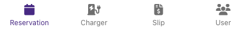
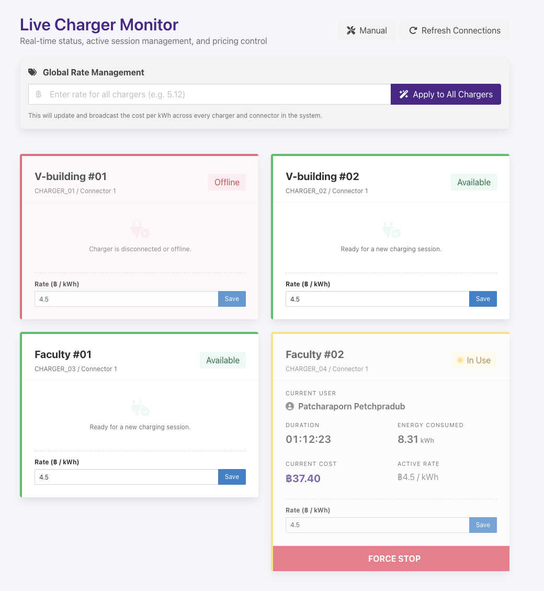
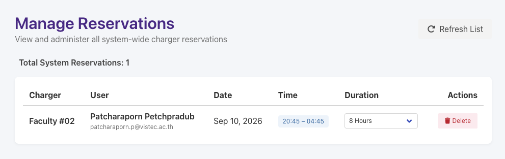
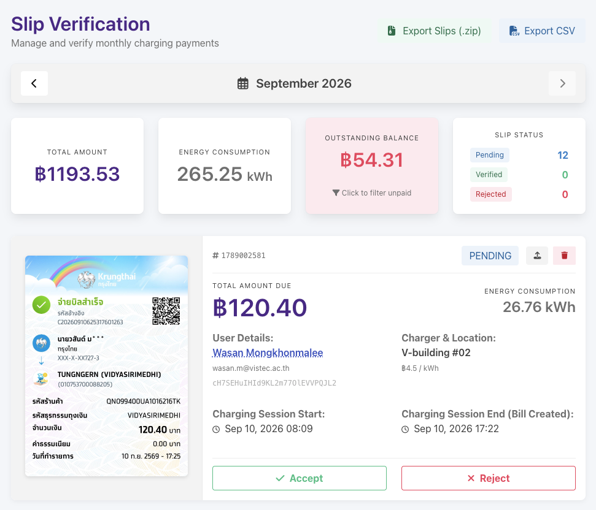
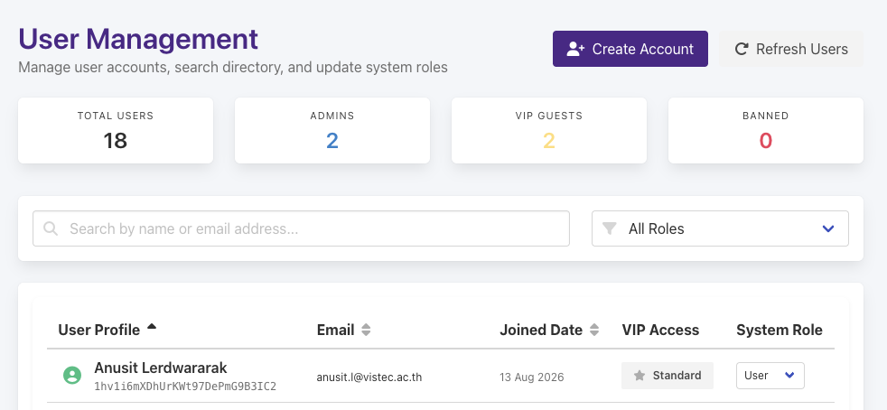

# VISTEC EV — Admin Guide

A guide to the administrator tools: monitoring chargers, managing reservations, verifying payments, and managing users.

## Contents

- [Getting Admin Access](#getting-admin-access)
- [Admin Navigation](#admin-navigation)
- [Charger Monitor](#charger-monitor)
- [Reservation Management](#reservation-management)
- [Slip Verification (Billing)](#slip-verification-billing)
- [User Management](#user-management)
- [VIP Access Explained](#vip-access-explained)
- [Things Not Covered by the App UI](#things-not-covered-by-the-app-ui)
- [Troubleshooting & Support](#troubleshooting--support)

---

## Getting Admin Access

Admin privileges are controlled by a user's **System Role**, set from the [User Management](#user-management) page (or directly on another admin's account). Once your account's role is `admin`:

- An **Admin** button appears in the top navigation bar and on your Account page, switching you into the admin section (`/admin/...`). A matching **User** button switches you back to the normal app.
- The bottom navigation bar changes to the admin tab set described below.

## Admin Navigation

The admin bottom navigation bar has four tabs:

| Tab | Page | What it's for |
|---|---|---|
| **Reservation** | `/admin` | All reservations, system-wide |
| **Charger** | `/admin/charger` | Live charger status, pricing, force start/stop |
| **Slip** | `/admin/slip` | Monthly billing & payment slip verification |
| **User** | `/admin/user` | User directory, roles, VIP access, account creation |

## Charger Monitor

**What it shows:** a live, real-time dashboard of every charging connector in the system. Each card shows a status badge — **Available** (green), **In Use** (yellow, with a pulsing indicator), or **Offline/Unknown** (red). A connector that's **In Use** also shows who's charging, a live elapsed-duration clock, energy used so far, running cost, and the applied rate. Everything updates live — no manual refresh needed, though a **Refresh Connections** button is available to reload from scratch.

**Setting prices:**
- **Global Rate Management** — enter a single ฿/kWh price and tap **Apply to All Chargers** to set that price across every charger and connector at once. You'll be asked to confirm, since this overwrites pricing everywhere.
- **Per-connector rate** — each card also has its own small rate field and **Save** button, to price just that one connector differently from the rest.

**Force Stop:** shown on any connector that's currently **In Use**. This immediately ends that session — it sends a stop command to the hardware, closes out the session, and generates an unpaid bill for the user based on energy used so far. You'll be asked to confirm first, since it affects a real user's session and billing.

**Manual Mode:** a toggle that reveals advanced, low-level controls — **Force Start** and **Force Trigger Stop** — for troubleshooting a stuck or misbehaving charger by sending a raw start/stop command directly to the hardware. This bypasses the normal status checks.

> ⚠️ **Force Trigger Stop does not update billing, ownership, or session records** the way the normal Force Stop does — it's purely a hardware command, for hardware troubleshooting only. A confirmation dialog explains this every time before it runs. Only use Manual Mode when you know what you're doing.

This page does **not** let you add new charger hardware — see [Things Not Covered by the App UI](#things-not-covered-by-the-app-ui).

## Reservation Management

**What it shows:** a single table of every active reservation in the system, across all chargers and users — charger/connector, the reserving user's name and email, date, time window, and duration. A running **Total System Reservations** count is shown above the table. It updates live as users (or other admins) create, edit, or cancel reservations, with a manual **Refresh List** button available too. If there's nothing to show, or if data fails to load, a friendly empty/error state is shown instead (with **Try Again** on error).

**Actions:**
- **Edit duration** — a dropdown on each row lets you change how long a reservation is booked for (30 min – 8 hours, same options users choose from). This only changes the duration/end time — not the start time, charger, connector, or user — and applies immediately, no confirmation needed.
- **Delete** — removes a reservation completely (from both the charger's schedule and the user's own list). You'll be asked to confirm first.

There's no search box or date filter here — it's always the full system list, sorted soonest-first, so use the charger/user/date columns to scan for what you need.

## Slip Verification (Billing)

This is the financial review page — bills and payment slips, one month at a time.

**Month navigation:** use the **◀ / ▶** arrows at the top to move between months (you can't go past the current month).

**Monthly summary dashboard** (four boxes):
- **Total Amount** — sum of everything owed/paid that month (VIP-free bills count their *estimated* value here, not ฿0 — see [VIP Access Explained](#vip-access-explained)).
- **Energy Consumption** — total kWh used that month.
- **Outstanding Balance** — total of still-unpaid bills. **This box is clickable** — tap it to filter the list down to unpaid bills only; tap again to clear that filter.
- **Slip Status** — counts of Pending / Verified / Rejected slips.

**Filtering by user:** in any bill's **User Details** section, the user's name is a clickable link — tap it to filter the whole page (list + summary boxes + exports) down to just that person's bills for the selected month. A banner appears describing the active filter(s), with a **Clear Filters** button. Tapping the same name again also clears it. This combines with the unpaid-only filter above (e.g. "this user's unpaid bills this month").

**Per-bill actions:**
- **Accept** — marks the uploaded slip as **Verified** (and the bill as **Paid**, if it wasn't already).
- **Reject** — marks the slip as **Rejected** and the bill as **Unpaid** again (e.g. the slip was fake or for the wrong amount).
- **Upload/Replace Slip** — lets an admin attach a payment slip image on the user's behalf (e.g. if they paid in person or via another channel). This sets the slip to **Pending** for review and marks the bill **Paid**.
- **Delete** — permanently removes the bill and its slip (image included). You'll be asked to confirm, since this can't be undone.

**Exports** (both respect the active user/unpaid filters above):
- **Export CSV** — downloads all currently-shown bills as a spreadsheet (dates, user, charger, energy, cost, status, slip status, slip URL).
- **Export Slips (.zip)** — downloads every uploaded slip image for the currently-shown bills, organized into folders by user name, converted to JPG.

## User Management

**What it shows:** a searchable, filterable directory of every user account, with summary counts (Total Users, Admins, VIP Guests, Banned) at the top.

**Search & filter:**
- Search box — matches by name or email.
- Role filter dropdown — All / User / Admin / VIP Only / Banned.
- **Sortable columns** — click **User Profile**, **Email**, or **Joined Date** in the table header to sort by that column; click again to flip between ascending/descending. An arrow icon shows the active sort.

**Per-user actions:**
- **VIP toggle** — grants or revokes [VIP Access](#vip-access-explained) (free charging) for that user. Confirmation required.
- **System Role dropdown** — change a user between **User**, **Admin**, and **Ban**. Confirmation required. A banned user is shown a "You are banned" screen and can't start charging or make reservations until un-banned (see `USER.md` → "If Your Account Is Banned").

**Creating an account:** tap **Create Account** (top of the page) to open a form for manually creating a new email/password login — this is the only way to create a guest account, since the app has no public sign-up. Fill in:
- **Display Name**
- **Email Address**
- **Password** (minimum 6 characters)
- **Confirm Password** — must match the password exactly; the field turns red with a "Re-entered password is not the same" message live if it doesn't, and the Create button stays disabled until everything is valid.

The new account is created with the standard **User** role (not VIP, not admin) — use the VIP toggle or role dropdown afterward if needed.

## VIP Access Explained

Marking a user as **VIP** (User Management → VIP toggle) makes their charging sessions free:

- When a VIP user stops a charging session, the bill is automatically created with ฿0 total cost and marked **Paid** — no QR code or slip upload is shown to them; they see a **Thank You** confirmation instead.
- On the **Slip Verification** page, these bills are clearly marked **VIP ACCESS** (instead of "No Slip") so you don't mistake them for a missing payment. The amount shown there is not ฿0 — it's the *estimated* cost (energy used × rate) so you can still track how much value was given away for free, shown in yellow to distinguish it from real revenue.
- VIP status is checked fresh from the database each time a session is stopped, so toggling VIP on/off for a user takes effect on their very next session — they don't need to log out and back in.

## Things Not Covered by the App UI

- **Adding new charger hardware** (new chargers/connectors, their names, connector type, max power) is not done through this app — it lives in the `site_config` data in Firebase and needs to be added there directly (Firebase console or by a developer). The Charger Monitor page can only manage pricing and live sessions for chargers that already exist in that configuration.
- **Realtime Database security rules** (who can read/write what) are managed in the Firebase console, not in this app.

## Troubleshooting & Support

If a charger reports Offline and a Force Stop/Restart doesn't resolve it, the same on-site troubleshooting steps shown to users apply (emergency stop button, wait for the blue LED). For anything hardware-related that the app can't fix remotely, contact:

- Line group: **"VISTEC ⇒ EV Charger"**
- Phone: **080-579-7336**
